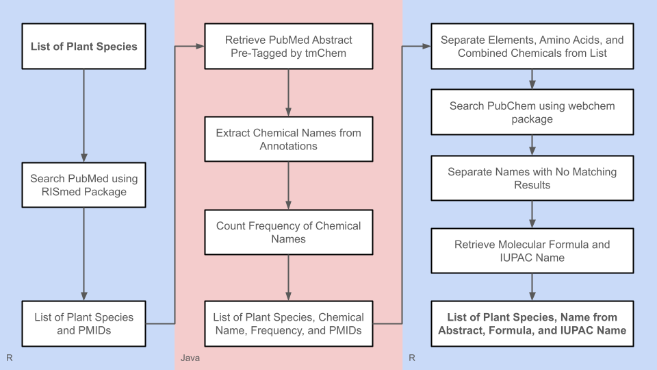

# Abstract Miner for Chemical Compounds (unfinished project)
R and Java code for extracting chemical compounds from PubMed abstracts of a given list of plant species.

Author: Jasmine Baclig

## Content
- input_files: folder containing various input files needed by the two R programs.
- misc_files: folder containing example code from the [G2PMineR project](https://github.com/BuerkiLabTeam/G2PMineR) (the inspiration/starting point for this project) and various other R scripts and CSV files that are not used by the current state of this project.
- output_files: folder containing files outputed by the R and Java programs.
- ChemicalMiner.java: Java code that is ran second in the workflow shown in the figure below.
- pmid_getter.R: R code that is ran first in the workflow shown in the figure below.
- post_java_analysis.R: R code that is ran third in the workflow shown in the figure below.
- slurm-batch-java.bash: sbatch script for running ChemicalMiner.java in the Borah computing cluster.
- slurm-batch-r.bash: sbatch script for running post_java_analysis.R in the Borah computing cluster.

## Current Workflow

## How To Use
- Run pmid_getter.R. Currently, this code takes in the input file "caribou_species_list.csv" and gets all the plant species listed in the column "Species name". The program will make a file called "pmid.txt" which contains a list of all the PMIDs of PubMed articles that come up when each plant species is looked up in PubMed.
- Compile and run ChemicalMiner.java. This code takes in the list of PMIDs in "pmid.txt" as its input and uses tmChem to mine each corresponding abstract for chemical names. The program then creates the output file "chemical.tsv" which contains in each row a plant species, a chemical name that could be associated with it, how many abstracts mentioned the chemical name, and a list of PMIDs of these abstracts.
  - Alternatively, this code can be run in a computing cluster using slurm-batch-java.bash.
  - Lines of code for running tmChem was taken from ["Beyond accuracy: creating interoperable and scalable text-mining web services"](https://academic.oup.com/bioinformatics/article/32/12/1907/1743015).
- Run post_java_analysis.R in a computing cluster using slurm-batch-r.bash. This uses "chemical.tsv" as its input file and starts to breakdown its content and looks up the chemical names in PubChem. Currently, this program creates the following files:
  - caribou_elements.csv: any instances of an element from the periodic table in "chemical.tsv".
  - caribou_amino_acids.csv: any instances of an amino acid in "chemical.tsv".
  - caribou_with_and.csv: any instances where an entry in "chemical.tsv" seem to contain names of two or more chemicals based on the presence of the word "and" in the chemical name.
  - caribou_no_cid_#_##.csv: returns the remaining entries in "chemical.tsv" that do not have a match in PubChem.
  - caribou_pre_iupac_#_##.csv: returns the remaining entries in "chemical.tsv" that has a match/matches in PubChem.
  - caribou_iupac\_#\_##.csv: returns a CSV file which contains in each row a plant species, a chemical name in "caribou_pre_iupac\_#\_##.csv" that could be associated with it, the molecular formula from a matching entry in PubChem, the IUPAC name from the same mathcing entry in PubChem.
    - Note: Because of the huge size of "chemical.tsv", it would take a really long time to analyze everything in one run. As such, some lines of code (indicated by in-line comments saying "##CHANGE BOUNDS##") in post_java_analysis.R are changed every run to only go through specific rows of "chemical.tsv". This is also reflected by the # and ## in some of the file names above.

## Remaining Questions and Future Directions
- Is there a better algorithm/tool out there for extracting chemical names from PubMed abstracts?
- In "caribou_elements.csv", there's a mix of element names and their abbreviation. A next step could be to combine entries that mention the same element through either its complete name or abbreviation (e.g., combining entries with the chemical names "carbon" and "c"), including combining their frequency count and PMID list.
  - Speaking of which, do we know for certain that chemical names like "c" or "n" are referring to the elements and not to something else?
- The same thing could be said regarding "caribou_amino_acids.csv" as above in terms of combining entries that refer to the same amino acid (based on the complete name and three-letter and single-letter abbreviations) and whether the single-letter codes are actually referring to an amino acid instead of something else.
- For "caribou_with_and.csv", another next step could be separating each entry into all individual chemical names that are mentioned. However, it probably isn't as simple as using the commas and/or "and" as the separators. For example, if this was done for the entry "abibalsamins a and b", the resulting separated names would be "abibalsamins a" and "b", which wouldn't really make sense by itself.
- What might be some reasons why some chemical names have no matches in PubChem in "caribou_no_cid_#_##.csv"? Is there a way to sort out those that are not actual chemicals versus those that could be chemicals but just not recognized by PubChem in its current name/format?
- In "caribou_iupac\_#\_##.csv", some chemical names from "caribou_pre_iupac\_#\_##.csv" have multiple matches in PubChem. How do we know which one is actually referred to by the abstract/article, especially when it comes to abbreviated chemical names? On a similar note, how do we deal with chemical names that are referring to a class of chemicals (e.g., "diterpene", "fatty acid")?
- How do we know whether a certain chemical is something that can actually be found in the plant species of interest (the research question) versus something that is just associated with the paper's method (e.g., "sodium dodecyl sulfate" for SDS-PAGE)?
- How can we parallelize the process for running post_java_analysis.R to make analyzing a large set of data (i.e., "chemical.tsv") faster?